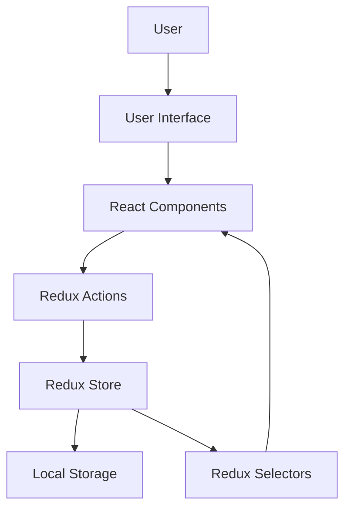
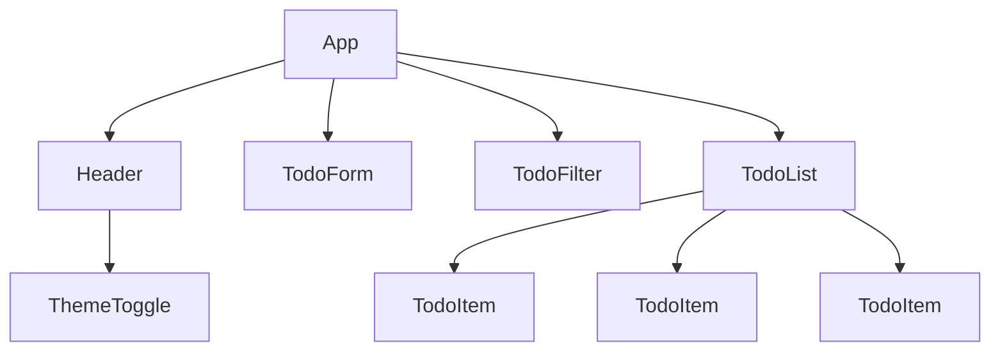

# Project Overview: React Todo Application

## Purpose and Goals

The React Todo Application is designed to provide users with a simple, effective way to manage daily tasks directly in their web browser. The primary goals of this project are:

1. **Create a user-friendly task management interface** that requires minimal learning
2. **Demonstrate modern React development practices** including component architecture, state management, and responsive design
3. **Deliver a fully functional frontend application** that works without a backend server
4. **Implement local storage persistence** for seamless user experience between sessions
5. **Balance simplicity with useful features** to create a practical, focused tool

## Current Architecture

The application follows a modern frontend architecture with clear separation of concerns:

### Architecture Diagram



### Layer Descriptions

1. **Presentation Layer**: React components responsible for rendering the UI and capturing user input
2. **State Management Layer**: Redux store and actions that maintain application state
3. **Data Persistence Layer**: LocalStorage integration for saving and retrieving data
4. **Business Logic Layer**: Implemented within Redux slices and utility functions

## Technology Stack

The application is built using the following key technologies:

| Category | Technologies |
|----------|--------------|
| **Core** | React 18, TypeScript, Redux Toolkit |
| **UI/UX** | Styled Components, React Beautiful DnD, Framer Motion |
| **Forms** | React Hook Form, Zod |
| **Utilities** | date-fns, nanoid, lodash-es (selective imports) |
| **Build Tools** | Vite, ESLint, Prettier |
| **Testing** | Vitest, React Testing Library |
| **Storage** | Browser localStorage API |

## Main Components

The application consists of several key components that work together:

### Core Components

1. **TodoList**: Main container for displaying tasks
2. **TodoItem**: Individual task representation with actions
3. **TodoForm**: Form for creating and editing tasks
4. **TodoFilter**: Controls for filtering and searching tasks
5. **Header**: Contains app title and global actions
6. **ThemeToggle**: Allows switching between light and dark themes

### Component Hierarchy



## Project Structure

The project follows a feature-based organization with the following structure:

```
src/
├── components/          # UI Components
│   ├── common/          # Reusable components
│   ├── todos/           # Todo-specific components
│   └── layout/          # Layout components
├── hooks/               # Custom React hooks
├── store/               # Redux state management
├── utils/               # Utility functions
├── types/               # TypeScript type definitions
├── App.tsx              # Main App component
└── index.tsx            # Application entry point
```

## Data Flow

1. **User Interaction**: User interacts with components (adding, editing, completing tasks)
2. **Action Dispatch**: Components dispatch Redux actions
3. **State Update**: Redux reducers update the state
4. **Component Re-render**: Connected components re-render with new state
5. **Persistence**: Redux middleware persists state to localStorage
6. **Data Loading**: On application start, data is loaded from localStorage into Redux

## Development Workflow

The development process follows these principles:

1. **Feature branches**: New features are developed in separate branches
2. **Pull requests**: Code is reviewed before merging
3. **Continuous integration**: Automated testing on commit
4. **Semantic versioning**: For release management
5. **Documentation**: Updated alongside code changes

## Future Roadmap

While maintaining the project's simplicity, potential enhancements include:

1. **Performance optimizations** for handling larger task lists
2. **Enhanced filtering options** for more specific task views
3. **Keyboard shortcut system** for power users
4. **Import/export functionality** for data backup
5. **Theme customization** beyond basic light/dark modes

This overview provides a high-level understanding of the React Todo Application's purpose, architecture, and component structure, serving as a foundation for more detailed technical documentation.