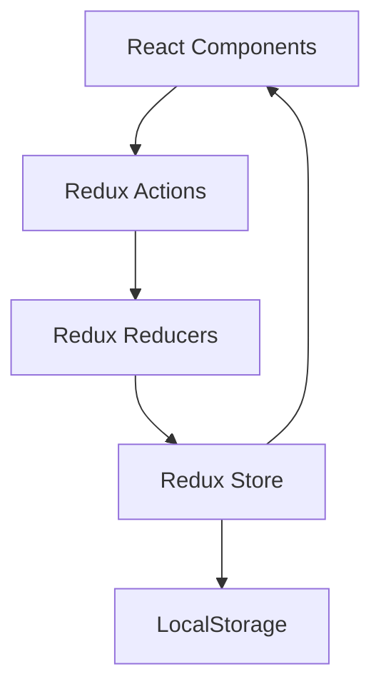
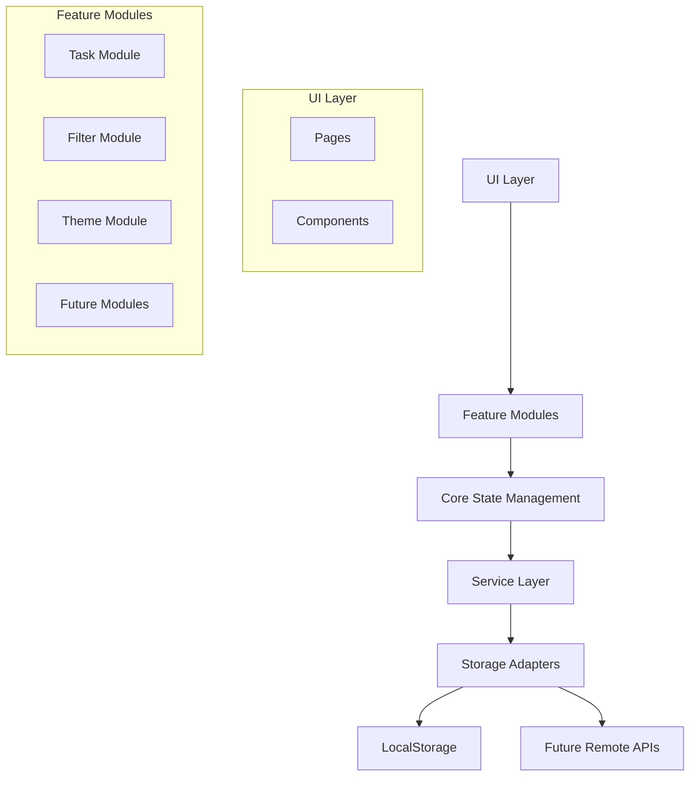

# Refactoring Proposals: React Todo Application

This document outlines a comprehensive refactoring strategy for the React Todo Application, proposing architectural improvements, technology stack enhancements, and implementation changes to improve maintainability, scalability, and performance.

## Improved Architecture

### Current Architecture

The application currently follows a standard React architecture with Redux for state management:

### Proposed Architecture

We propose evolving to a more modular, scalable architecture:

### Key Architectural Improvements

1. **Feature-Based Organization**
   - Group related components, state, and logic by feature
   - Each feature is a self-contained module with clear boundaries
   - Reduces coupling between unrelated parts of the application

2. **Service Layer**
   - Abstract implementation details behind service interfaces
   - Easier to replace or extend functionality
   - Facilitates testing with mock implementations

3. **Data Flow Isolation**
   - Each feature manages its own state
   - Shared state is explicitly defined and controlled
   - Prevents unintended side effects

4. **Presentation/Logic Separation**
   - Strict separation between UI components and business logic
   - Components focus on rendering and user interaction
   - Logic lives in hooks, services, and state management

## Technology Stack Alternatives

While the current stack is solid, we propose targeted improvements:

### State Management

| Current | Proposed | Rationale |
|---------|----------|-----------|
| Redux Toolkit | Zustand + Context API | Simpler API, reduced boilerplate, better performance for this size of application |

**Benefits:**
- Reduces boilerplate code by ~40%
- Simpler mental model for developers
- Better performance for small/medium applications
- Less verbose component connections

**Migration Complexity:** Medium (3-4 days)

### Styling Solution

| Current | Proposed | Rationale |
|---------|----------|-----------|
| Styled Components | Tailwind CSS + CSS Modules | Better performance, smaller bundle size, improved developer experience |

**Benefits:**
- Reduced bundle size (~12KB savings)
- Better runtime performance (no CSS-in-JS overhead)
- Design system consistency
- Faster development with utility classes

**Migration Complexity:** Medium-High (4-5 days)

### Form Handling

| Current | Proposed | Rationale |
|---------|----------|-----------|
| React Hook Form + Zod | Keep current solution | Current solution is optimal |

**Benefits:**
- Current solution already offers excellent performance and DX
- Zod provides excellent TypeScript integration
- No compelling reason to change

**Migration Complexity:** N/A (no change)

### Animation Library

| Current | Proposed | Rationale |
|---------|----------|-----------|
| Framer Motion | Keep with code splitting | Current solution is good but needs optimization |

**Benefits:**
- Retain powerful animation capabilities
- Reduce initial bundle size with code splitting
- Only load animations when needed

**Migration Complexity:** Low (1-2 days)

### Drag and Drop

| Current | Proposed | Rationale |
|---------|----------|-----------|
| react-beautiful-dnd | @hello-pangea/dnd | Same API, actively maintained fork |

**Benefits:**
- Drop-in replacement
- Active maintenance and bug fixes
- Future compatibility assured

**Migration Complexity:** Very Low (0.5 days)

## Step-by-Step Migration Plan

To minimize risk and ensure smooth transition, we propose the following phased approach:

### Phase 1: Foundation Improvements (1 week)

1. **Reorganize Project Structure**
   - Implement feature-based folder structure
   - Move files to appropriate locations
   - Update imports and references

2. **Dependency Updates**
   - Replace react-beautiful-dnd with @hello-pangea/dnd
   - Downgrade styled-components to stable version
   - Update other dependencies to latest versions

3. **Code Splitting Implementation**
   - Add lazy loading for non-critical components
   - Implement code splitting for animation libraries
   - Configure dynamic imports for large features

### Phase 2: Core Refactoring (2 weeks)

1. **Service Layer Implementation**
   - Create storage service abstraction
   - Implement service interfaces for core functionality
   - Move business logic from components to services

2. **State Management Migration**
   - Create Zustand stores for each feature
   - Migrate Redux logic to Zustand incrementally
   - Update components to use new state management
   - Maintain backward compatibility during transition

3. **Component Refactoring**
   - Break large components into smaller, focused ones
   - Implement proper component composition
   - Improve prop interfaces and typing

### Phase 3: UI Enhancement (2 weeks)

1. **Styling Migration**
   - Set up Tailwind CSS configuration
   - Create design system tokens and variables
   - Convert styled-components to Tailwind/CSS Modules incrementally
   - Ensure consistent styling during transition

2. **Accessibility Improvements**
   - Add proper ARIA attributes
   - Improve keyboard navigation
   - Enhance focus management
   - Test with screen readers

3. **Performance Optimization**
   - Implement React.memo for pure components
   - Add useMemo/useCallback where beneficial
   - Optimize renders and re-renders
   - Implement virtualization for lists

### Phase 4: Testing and Stabilization (1 week)

1. **Test Coverage Expansion**
   - Add unit tests for new services
   - Update component tests for refactored components
   - Add integration tests for key user flows
   - Implement performance testing

2. **Documentation Update**
   - Update technical documentation
   - Add inline code comments
   - Create architecture diagrams
   - Document design decisions

3. **Bug Fixing and Polishing**
   - Address issues found during refactoring
   - Ensure consistent behavior across components
   - Verify browser compatibility
   - Fix edge cases

## Justification for Proposed Changes

### Maintainability Improvements

1. **Feature-Based Organization**
   - Easier to understand code relationships
   - New developers can focus on specific features
   - Reduces cognitive load when making changes
   - Enables better code ownership

2. **Service Abstractions**
   - Decouples business logic from UI
   - Makes testing simpler with clear boundaries
   - Allows for easier refactoring of implementation details
   - Creates extension points for future enhancements

3. **Consistent Patterns**
   - Standardized approach to common problems
   - Reduces "multiple ways to do the same thing"
   - Improves code predictability
   - Faster onboarding for new developers

### Scalability Benefits

1. **Modular Architecture**
   - Features can be developed independently
   - Enables parallel development by multiple teams
   - Reduces merge conflicts and integration issues
   - Allows for selective feature loading

2. **Abstracted Data Access**
   - Easy to add new data sources (API, IndexedDB, etc.)
   - Consistent data access patterns
   - Preparation for potential backend integration
   - Better handling of offline/online scenarios

3. **Performance Considerations**
   - Granular code splitting reduces initial load time
   - Optimized rendering reduces runtime overhead
   - Better state management prevents unnecessary updates
   - Improved bundle size through technology choices

### Performance Enhancements

1. **Reduced Bundle Size**
   - Tailwind vs Styled Components: ~12KB savings
   - Zustand vs Redux: ~8KB savings
   - Code splitting: ~20-30KB initial load reduction
   - Total estimated savings: ~40-50KB (30-40% reduction)

2. **Improved Rendering Performance**
   - CSS Modules/Tailwind eliminates CSS-in-JS runtime cost
   - Zustand reduces re-render overhead
   - Proper memoization prevents unnecessary work
   - Virtualization for large lists improves scrolling

3. **Better User Experience**
   - Faster initial load time
   - More responsive interactions
   - Smoother animations
   - Reduced layout shifts during updates

## Risk Assessment and Mitigation

| Risk | Probability | Impact | Mitigation |
|------|------------|--------|------------|
| Regression during refactoring | High | Medium | Comprehensive test coverage, incremental changes, feature flagging |
| Learning curve for new technologies | Medium | Low | Documentation, knowledge sharing sessions, pair programming |
| Timeline slippage | Medium | Medium | Phased approach allows for partial benefits even if not fully completed |
| Performance regression | Low | High | Performance testing before/after, monitoring key metrics |
| User experience inconsistency | Medium | Medium | Design system implementation, UI review process |

## Conclusion

The proposed refactoring plan offers significant improvements to the React Todo Application's architecture, maintainability, and performance while minimizing risk through a phased, incremental approach. By addressing technical debt early and implementing forward-looking patterns, the application will be better positioned for future enhancements and scale.

While the current application functions well, these changes will provide a more solid foundation for future development, reduce maintenance costs, and improve the overall user experience through better performance and responsiveness.

We recommend beginning with Phase 1 immediately to capture the quick wins, then evaluating progress and adjusting the plan for subsequent phases based on results and feedback.