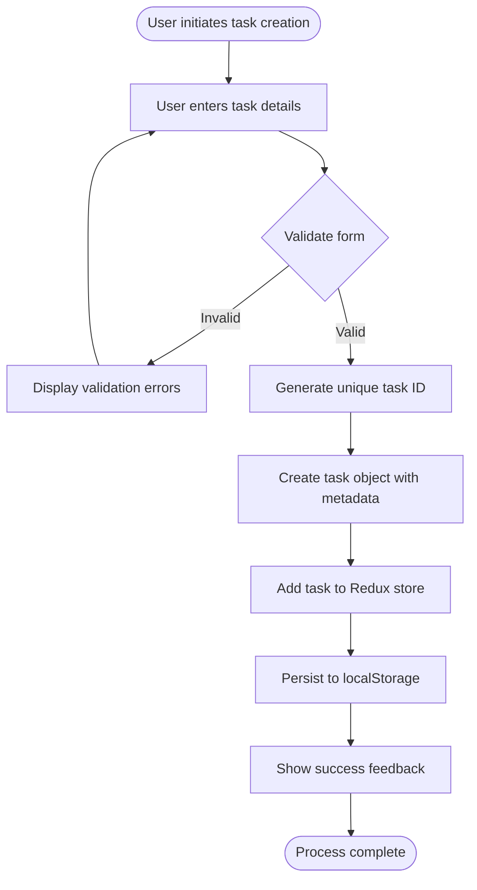
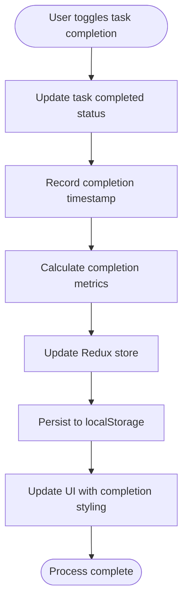
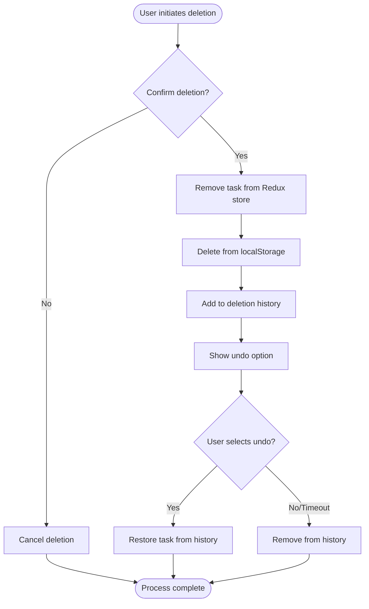
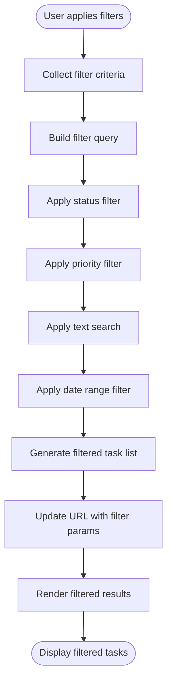
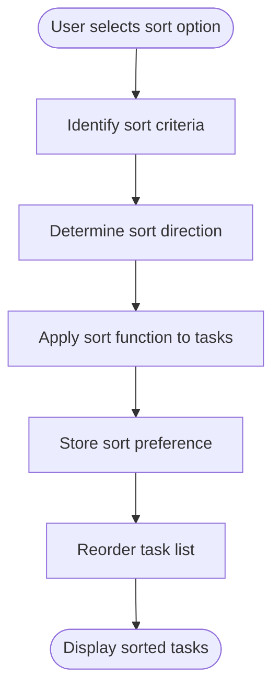
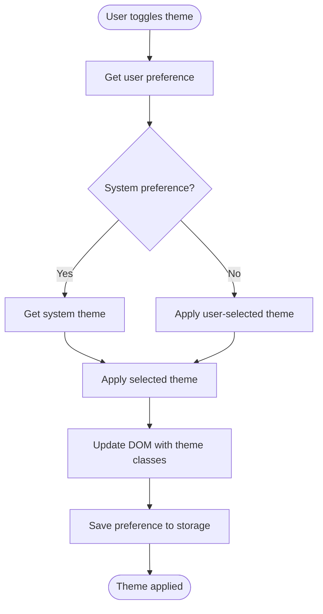
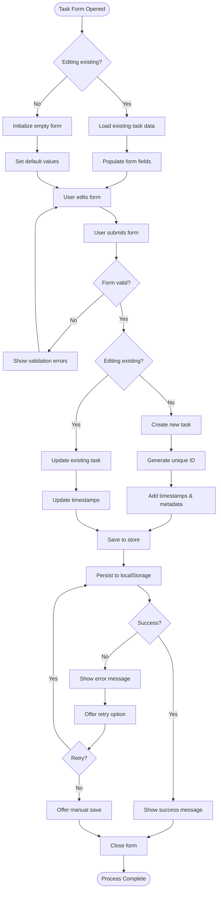
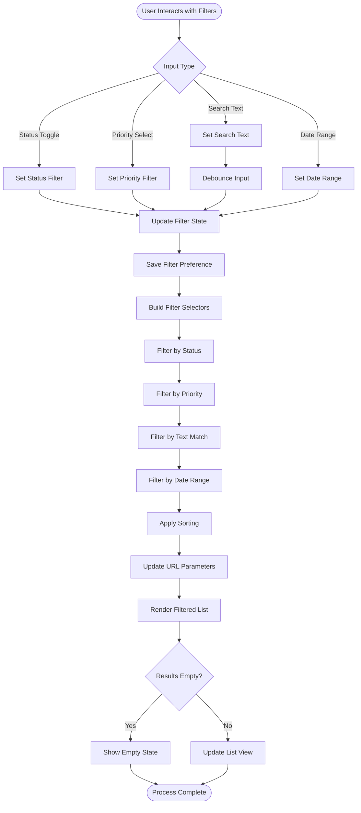

# Business Logic Documentation: React Todo Application

This document outlines the key business processes implemented in the Todo application, detailing the logic flow, rules, and implementation details for each core feature.

## Core Business Processes

### Task Management Lifecycle

The application manages tasks through a complete lifecycle from creation to completion or deletion, with several key processes involved.

#### Task Creation Process



**Business Rules:**
- Task title is required and must be between 3-100 characters
- Task description is optional
- Priority defaults to "medium" if not specified
- New tasks are always created with completed = false
- Creation timestamp is automatically generated
- Each task must have a globally unique ID

**Implementation Details:**
- Task validation implemented using Zod schema
- ID generation uses nanoid for collision-free unique IDs
- Default values are set in the reducer if not provided
- Optimistic UI updates before persistence completes

#### Task Completion Process



**Business Rules:**
- Completed tasks retain all metadata and remain visible
- Completion timestamp is recorded when task is marked complete
- Timestamp is cleared if task is marked incomplete again
- Completed tasks may be filtered out of primary view based on user preference
- Completed tasks can be uncompleted with no restrictions

**Implementation Details:**
- Toggle action handles both completion and un-completion
- Completion metrics calculate statistics for potential future features
- Visual indicators (strikethrough, lower opacity) show completed state
- Filter system respects task completion state

#### Task Deletion Process



**Business Rules:**
- Task deletion requires confirmation to prevent accidental deletion
- Deleted tasks are stored in history for potential restoration
- Deletion history is maintained for 30 days
- Mass deletion option available for completed tasks
- Deletion history is limited to 100 most recent items

**Implementation Details:**
- Confirmation dialog prevents accidental deletions
- Deletion history is stored in localStorage with task data
- Undo functionality available for 10 seconds after deletion
- Bulk deletion optimizes multiple delete operations

### Task Filtering and Organization

The application provides comprehensive filtering and organization features to help users manage their tasks effectively.

#### Filtering System



**Business Rules:**
- Multiple filters can be applied simultaneously
- Filters combine with AND logic (all criteria must match)
- Empty search terms and "All" filter options are ignored
- Filter state persists between sessions
- Filters can be saved as presets for quick access
- Filter state is reflected in URL for sharing/bookmarking

**Implementation Details:**
- Filtering logic uses memoized selectors for performance
- URL query parameters sync with filter state
- Debounced search prevents excessive re-renders
- Filter presets stored in localStorage

#### Task Sorting



**Business Rules:**
- Available sort options: creation date, due date, priority, alphabetical
- Sort direction can be ascending or descending
- Default sort is by creation date (newest first)
- Sort preferences persist between sessions
- Completed tasks may be grouped at the bottom regardless of sort

**Implementation Details:**
- Sort functions defined for each criteria type
- Direction toggle stored in user preferences
- Custom comparator functions handle different data types
- Sort state stored in Redux and persists to localStorage

### Theme Management

The application supports theme customization to enhance user experience and accessibility.



**Business Rules:**
- Three theme options: light, dark, system (follows OS preference)
- Default theme follows system preference
- Theme preference persists between sessions
- Theme changes apply instantly without page reload
- High contrast mode available for accessibility

**Implementation Details:**
- Theme stored in Redux for global access
- CSS variables define theme colors
- Media query detects system preference
- LocalStorage persists theme preference
- Theme provider wraps application for context access

## Business Logic Implementation

### Current Implementation Assessment

The business logic for the Todo application is currently implemented primarily through Redux slices and React components. This section evaluates the current implementation and identifies areas for improvement.

#### Strengths of Current Implementation

1. **Clear Separation of Concerns**
   - Redux actions and reducers separate data manipulation from UI
   - Component composition isolates UI responsibilities
   - Selectors abstract data retrieval logic

2. **Predictable State Management**
   - Centralized state provides a single source of truth
   - Immutable updates prevent side effects
   - Action history enables time-travel debugging

3. **Type Safety**
   - TypeScript provides compile-time checking
   - Interface definitions ensure data consistency
   - Reduced runtime errors through type validation

#### Areas for Improvement

1. **Business Logic Distribution**
   - Some business logic lives in components instead of services
   - Validation rules duplicated across components
   - Complex operations span multiple files without clear documentation

2. **Error Handling**
   - Inconsistent error handling patterns
   - Insufficient user feedback for failed operations
   - Recovery paths not always clearly defined

3. **Edge Cases**
   - Incomplete handling of concurrent operations
   - Limited offline support strategy
   - Potential data loss during storage errors

### Proposed Implementation Improvements

To address these issues, we propose the following improvements to the business logic implementation:

1. **Service Layer Introduction**
   - Create a TaskService to encapsulate task operations
   - Implement StorageService for data persistence
   - Develop FilterService for advanced filtering logic

2. **Domain Model Enhancement**
   - Expand task model with additional metadata
   - Create a TaskCollection class for bulk operations
   - Implement robust validation as part of the domain model

3. **Error Handling Strategy**
   - Develop consistent error handling patterns
   - Implement retry logic for storage operations
   - Add comprehensive error feedback system

## Critical Business Processes Flowcharts

### Task Creation and Editing Flow



### Filter and Search Logic Flow



## Business Logic Documentation

### Task Data Structure

```typescript
interface Task {
  // Core properties
  id: string;          // Unique identifier
  title: string;       // Task title
  description?: string; // Optional detailed description
  completed: boolean;  // Completion status
  
  // Categorization & prioritization
  priority: 'low' | 'medium' | 'high'; // Priority level
  tags?: string[];     // Optional categorization tags
  
  // Temporal information
  createdAt: string;   // ISO timestamp of creation
  updatedAt: string;   // ISO timestamp of last update
  completedAt?: string; // ISO timestamp of completion (if completed)
  dueDate?: string;    // Optional due date as ISO timestamp
  
  // Additional metadata
  order?: number;      // Optional display order for manual sorting
  notes?: string;      // Optional additional notes
}
```

### Task Validation Rules

```typescript
// Using Zod for validation
const taskSchema = z.object({
  id: z.string().min(1),
  title: z.string().min(3).max(100),
  description: z.string().max(1000).optional(),
  completed: z.boolean(),
  priority: z.enum(['low', 'medium', 'high']),
  tags: z.array(z.string()).optional(),
  createdAt: z.string().datetime(),
  updatedAt: z.string().datetime(),
  completedAt: z.string().datetime().optional(),
  dueDate: z.string().datetime().optional(),
  order: z.number().int().optional(),
  notes: z.string().max(5000).optional()
});
```

### Filter State Structure

```typescript
interface FilterState {
  // Status filtering
  status: 'all' | 'active' | 'completed';
  
  // Priority filtering
  priority: 'all' | 'low' | 'medium' | 'high';
  
  // Text search
  searchTerm: string;
  
  // Date filtering
  dueDateStart?: string; // ISO timestamp
  dueDateEnd?: string;   // ISO timestamp
  
  // Sort options
  sortBy: 'createdAt' | 'dueDate' | 'priority' | 'title';
  sortDirection: 'asc' | 'desc';
  
  // Display options
  groupByTags: boolean;
  showCompleted: boolean;
  
  // Saved filter name (if saved)
  savedName?: string;
}
```

### Business Logic Implementation Patterns

#### Task Creation

```typescript
// In Task service
class TaskService {
  create(taskData: Partial<Task>): Task {
    // Validate required fields
    if (!taskData.title) {
      throw new ValidationError('Task title is required');
    }
    
    // Generate missing fields
    const now = new Date().toISOString();
    const newTask: Task = {
      id: nanoid(),
      title: taskData.title,
      description: taskData.description || '',
      completed: false,
      priority: taskData.priority || 'medium',
      tags: taskData.tags || [],
      createdAt: now,
      updatedAt: now,
      dueDate: taskData.dueDate,
      order: this.getNextOrder(),
      notes: taskData.notes || ''
    };
    
    // Validate complete task
    const validationResult = this.validateTask(newTask);
    if (!validationResult.success) {
      throw new ValidationError(validationResult.errors);
    }
    
    // Persist task
    try {
      this.storageService.saveTask(newTask);
      return newTask;
    } catch (error) {
      this.errorService.handleError(error, 'TaskCreationError');
      throw new PersistenceError('Failed to save task');
    }
  }
  
  private validateTask(task: Task): ValidationResult {
    try {
      taskSchema.parse(task);
      return { success: true };
    } catch (error) {
      return { 
        success: false,
        errors: error.errors
      };
    }
  }
  
  private getNextOrder(): number {
    const tasks = this.storageService.getAllTasks();
    if (tasks.length === 0) return 0;
    return Math.max(...tasks.map(t => t.order || 0)) + 1;
  }
}
```

#### Task Filtering

```typescript
// In Filter service
class FilterService {
  applyFilters(tasks: Task[], filters: FilterState): Task[] {
    return tasks
      .filter(task => this.matchesStatusFilter(task, filters.status))
      .filter(task => this.matchesPriorityFilter(task, filters.priority))
      .filter(task => this.matchesSearchTerm(task, filters.searchTerm))
      .filter(task => this.matchesDateFilter(task, filters.dueDateStart, filters.dueDateEnd))
      .sort((a, b) => this.sortTasks(a, b, filters.sortBy, filters.sortDirection));
  }
  
  private matchesStatusFilter(task: Task, status: FilterState['status']): boolean {
    if (status === 'all') return true;
    return status === 'completed' ? task.completed : !task.completed;
  }
  
  private matchesPriorityFilter(task: Task, priority: FilterState['priority']): boolean {
    if (priority === 'all') return true;
    return task.priority === priority;
  }
  
  private matchesSearchTerm(task: Task, searchTerm: string): boolean {
    if (!searchTerm) return true;
    const term = searchTerm.toLowerCase();
    return (
      task.title.toLowerCase().includes(term) ||
      (task.description?.toLowerCase().includes(term) || false) ||
      (task.notes?.toLowerCase().includes(term) || false) ||
      task.tags?.some(tag => tag.toLowerCase().includes(term)) || false
    );
  }
  
  private matchesDateFilter(
    task: Task, 
    startDate?: string, 
    endDate?: string
  ): boolean {
    if (!task.dueDate) return !startDate && !endDate;
    if (!startDate && !endDate) return true;
    
    const dueDate = new Date(task.dueDate).getTime();
    const start = startDate ? new Date(startDate).getTime() : 0;
    const end = endDate ? new Date(endDate).getTime() : Infinity;
    
    return dueDate >= start && dueDate <= end;
  }
  
  private sortTasks(
    a: Task, 
    b: Task, 
    sortBy: FilterState['sortBy'], 
    direction: FilterState['sortDirection']
  ): number {
    const multiplier = direction === 'asc' ? 1 : -1;
    
    switch (sortBy) {
      case 'createdAt':
        return (new Date(a.createdAt).getTime() - new Date(b.createdAt).getTime()) * multiplier;
      
      case 'dueDate':
        // Handle cases where dueDate might be undefined
        if (!a.dueDate && !b.dueDate) return 0;
        if (!a.dueDate) return 1 * multiplier;
        if (!b.dueDate) return -1 * multiplier;
        return (new Date(a.dueDate).getTime() - new Date(b.dueDate).getTime()) * multiplier;
      
      case 'priority':
        // Convert priority to numeric value for comparison
        const priorityValues = { high: 3, medium: 2, low: 1 };
        return (priorityValues[a.priority] - priorityValues[b.priority]) * multiplier;
      
      case 'title':
        return a.title.localeCompare(b.title) * multiplier;
      
      default:
        return 0;
    }
  }
}
```

## Business Logic Errors and Improvements

### Identified Issues in Business Logic

1. **Inconsistent Date Handling**
   - Some parts of the application use string dates, others use Date objects
   - Timezone issues can occur when comparing dates
   - **Fix**: Standardize on ISO strings and use proper date comparison utilities

2. **Validation Inconsistencies**
   - Form validation doesn't always match model validation
   - Some edge cases are not properly handled
   - **Fix**: Create shared validation logic between UI and services

3. **Task Dependency Handling**
   - No support for task dependencies or subtasks
   - **Fix**: Implement parent-child relationships for tasks

4. **Filter Performance**
   - Current filtering approach is inefficient for large task lists
   - **Fix**: Implement memoization and virtualization for filtered lists

### Business Process Improvements

1. **Task Categorization Enhancement**
   - Current tag system is basic and not hierarchical
   - **Improvement**: Implement tag hierarchy and color coding

2. **Smart Sorting Algorithms**
   - Add machine learning-based priority suggestions
   - Implement "focus mode" that intelligently surfaces important tasks

3. **Workflow Templates**
   - Add predefined task templates for common workflows
   - Allow